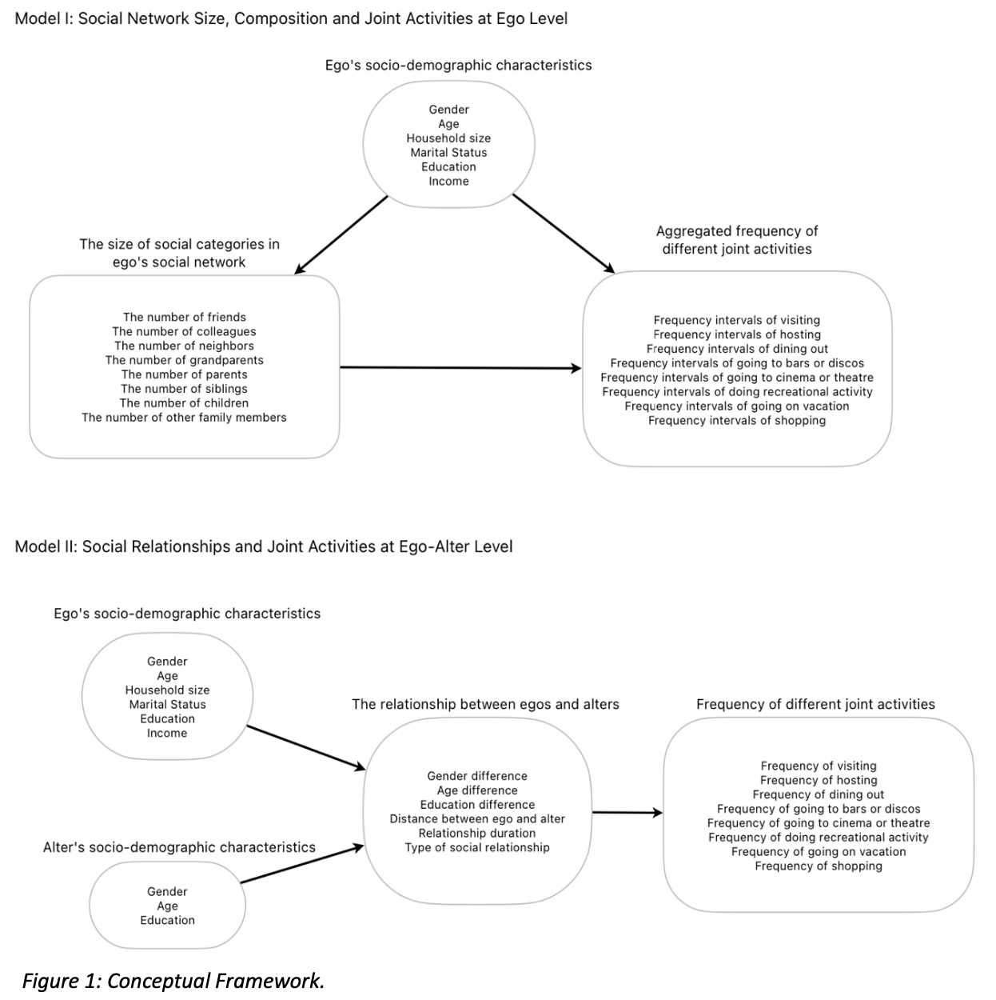

# Social network analysis project
This research project explores the influence of social networks on travel behavior, focusing on how interactions between individuals and their social network members affect the frequency of joint activities. The dynamics of social networks and joint activities frequncy are analyzed through two models:

### Model I: Social Network Size, Composition and Joint Activities at Ego Level
Model I examines:
- The overall composition and size of social networks.
- Frequency intervals of joint activities with all social network members.
- Impact of socio-demographic characteristics on network size and activity frequency.

**Key Variables**:
- Individual socio-demographic characteristics.
- Social network size for each social category (e.g., friends, colleagues).
- Frequency of joint activities.

### Model II: Social Relationships and Joint Activities at Ego-Alter Level
Model II explores:
- The influence of differences (or similarities) between egos and alters on joint activity frequency.
- The effects of gender, age, education differences, geographical distance, relationship duration, and social categories on joint activity frequency.

**Key Variables**:
- Differences in gender, age, education, geographical distance, and relationship duration.
- Social relationship types and joint activity frequencies.

## Directory Structure
- `data/`: Stores raw datasets.
- `bbn/`: Contains the developed Bayesian Belief Network models.
- `ref/`: Includes figures and references, including the master's thesis.
- `results/`: Generated tables, figures, and analysis outputs.
  -`figures/`: Generated graphs.
  -`tables/`: Generated tables.
- `src/`: Python scripts for data processing, analysis, and visualization.
  - `data.py`: Descriptive statistics.
  - `aggregate.py`: Recalculates variables for Model 1.
  - `plot_model1.py`: Analyzes and visualizes Model 1 data.
  - `plot_model2.py`: Analyzes and visualizes Model 2 data.
- `README.md`: Project description.

## Methodology
This research employed Bayesian Belief Networks (BBNs) to model the interdependencies between social network and travel behavior. The analysis uses GeNIe software to reason probabilistically and infer relationships between multiple variables.

The conceptual framework for this research project:

- Model I synthesizes individuals' socio-demographic characteristics, social network composition, and joint activity frequencies at the ego level.
- Model II emphasizes a disaggregated view of social interactions, incorporating ego's and alter's socio-demographic characteristics, homophily/heterogeneity between ego and alter, social relationship types, and joint activity frequency.

## Conclusion
Bayesian Belief Networks were chosen for their ability to simultaneously model and infer complex relationships between variables. This project successfully developed two models at the ego and ego-alter levels, which are stored in the bbn/ directory.
For a detailed explanation of the methodology and findings, please refer to the master's thesis in the ref/ directory. This GitHub repository primarily serves as documentation and showcases my data analysis skills using Python.

